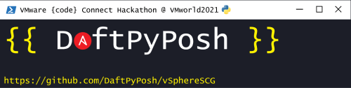
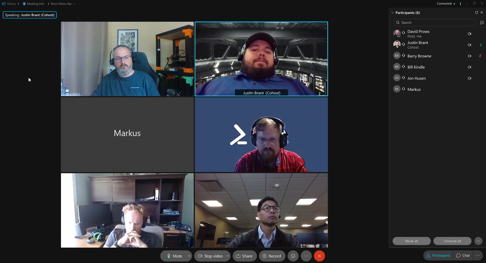

# VMware {code} Connect Hackathon 2021 - Team DaftPyPosh - vSphereSCG

## Team Members

- Barry Browne [@barrybrowne](https://twitter.com/barrybrowne)
- Bill Kindle [@billkindle](https://www.linkedin.com/in/billkindle/)
- David Prows [@Commputethis](https://twitter.com/commputethis)
- Jon Husen [@JonHusen](https://twitter.com/JonHusen)
- Justin Brant [@JustinBrant93](https://twitter.com/JustinBrant93)
- Markus Kraus [@vMarkus_K](https://twitter.com/vMarkus_K)

## The Idea

Initially, there was a couple of us who wanted to participate in the Hackathon, but we didn't really have thoughts on what to do.  After some messaging around we found others to join the team, but we still didn't have an idea. Markus asked if a team was looking for an Ansible project.  Well, **we didn't have an idea and we all knew what Ansible is and a couple of us had a little experience using it.**  So we added Markus to the team and we decided to work on an Ansible based toolkit to apply the [VMware vSphere Security Configuration Guide](https://core.vmware.com/vmware-vsphere-security-configuration-guide-7) to an existing ESXi deployment.

## Goals

- 100% of recommendations should be possible (as long as it's not a permanent task like "ESXi is up to date." )
- Configurable which Recommendations should be applied
- Deliverable as Ansible Collection via Ansible Galaxy

## What we learned

- Some learned more about git and/or Github, like using projects, issues, and proper use of branches/merge requests
- Some of us learned how to install/run our first Ansible playbook
- We learned about Roles inside of Ansible
- Some learned how to attach issues to merge requests in Github
- For at least one of us, it was our first exposure to VMWare Power-CLI

## Challenges we had

- One challenge we had was having a place to do testing of the code.  Some had to build out a lab to be able to do testing with.
- Time differences.  We have team members spread across 3 time zones (up to 6 hours apart), 3 different countries, and 2 different continents.

## The Future

We plan to open this up to the community to help maintain as updated guides come out in the future.
