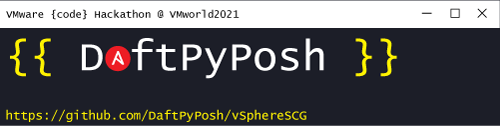

# VMware {code} Connect Hackathon 2021 - Team DaftPyPosh - vSphereSCG



## Team Members

- Barry Browne [@barrybrowne](https://twitter.com/barrybrowne)
- Bill Kindle [@billkindle](https://www.linkedin.com/in/billkindle/)
- Carl Capozza [@Carlcapozza](https://twitter.com/Carlcapozza)
- David Prows [@Commputethis](https://twitter.com/commputethis)
- Jon Husen [@JonHusen](https://twitter.com/JonHusen)
- Justin Brant [@JustinBrant93](https://twitter.com/JustinBrant93)
- Markus Kraus [@vMarkus_K](https://twitter.com/vMarkus_K)

## The Idea

An Ansible based toolkit to apply the [VMware vSphere Security Configuration Guide](https://core.vmware.com/vmware-vsphere-security-configuration-guide-7) to an exisitng infrastructure.

### Examples around the idea

[VMware vSphere Security Configuration Guide](https://core.vmware.com/vmware-vsphere-security-configuration-guide-7)

- ESXi Security Configuration
- VM Security Configuration
- DVS Security Configuration

Some examples how this configurations are possible:

- <https://mycloudrevolution.com/en/2020/06/15/esxi-ntp-security-configuration/>
- <https://mycloudrevolution.com/en/2019/05/27/vsphere-vm-security-configuration-with-ansible/>
- <https://mycloudrevolution.com/en/2019/04/09/vmware-esxi-security-configuration-with-ansible/>
  
80% of the configurations might be done pretty quick, the other 20% are the problem.

## Goals

- 100% of recommendations should be possible (as long as it's not a permanent task like "ESXi is up to date." )
- Configurable which Recommendations should be applied
- Deliverable as Ansible Collection via Ansible Galaxy

## Code Structure

The Project is shipped as an Ansible Collection with Roles. The Roles do contain the Hardening Tasks for the infrastructure objects.

```Markdown
└── vspherescg
    ├── docs
    ├── galaxy.yml
    ├── plugins
    │   └── README.md
    ├── README.md
    └── roles
        ├── esxi_scg
        │   ├── defaults
        │   │   └── main.yml
        │   ├── files
        │   ├── handlers
        │   │   └── main.yml
        │   ├── meta
        │   │   └── main.yml
        │   ├── README.md
        │   ├── tasks
        │   │   └── main.yml
        │   ├── templates
        │   ├── tests
        │   │   ├── inventory
        │   │   └── test.yml
        │   └── vars
        │       └── main.yml
        ├── vcenter_scg
        │   ├── defaults
        │   │   └── main.yml
        │   ├── files
        │   ├── handlers
        │   │   └── main.yml
        │   ├── meta
        │   │   └── main.yml
        │   ├── README.md
        │   ├── tasks
        │   │   └── main.yml
        │   ├── templates
        │   ├── tests
        │   │   ├── inventory
        │   │   └── test.yml
        │   └── vars
        │       └── main.yml
        └── vm_scg
            ├── defaults
            │   └── main.yml
            ├── files
            ├── handlers
            │   └── main.yml
            ├── meta
            │   └── main.yml
            ├── README.md
            ├── tasks
            │   └── main.yml
            ├── templates
            ├── tests
            │   ├── inventory
            │   └── test.yml
            └── vars
                └── main.yml
```
